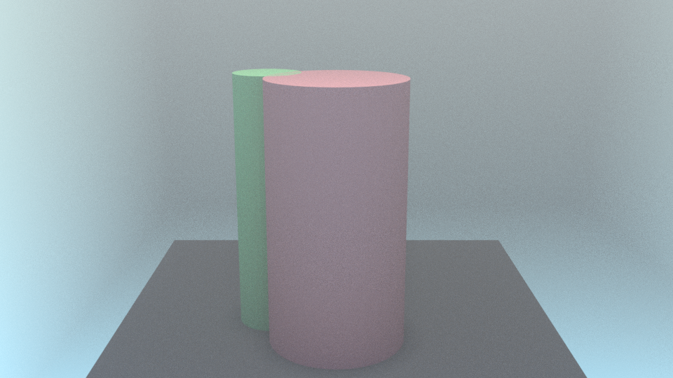
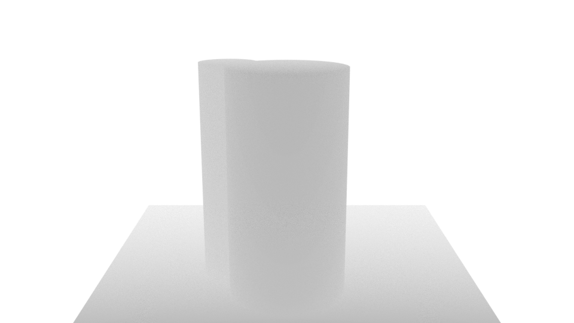
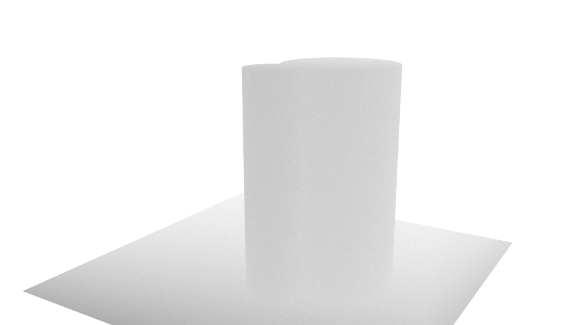

# 3D Hazy Image Generator

haze_generator.py is a Blender script for creating large number of 3D hazy scenes with random or input air transmittance. The 3D scenes also have associated depth information that can be used to extract depth maps. The outputs of this script are sets of 2D images taken from multiple views of the 3D images, and also include the position of cameras and labels for air transmittance that can be used for image depth neural network training, dehazing algorithm and 3D haze reconstruction.

For how the depth infomation is added, refer to this github repo: https://github.com/LouisFoucard/DepthMap_dataset

Blender is a open source 3D graphics and animation software, downloadable at "https://www.blender.org/".

## Example images

Here is some example images:

  

Here is the associated depth map:

 
  

## Support Feature
- can randomly assign uncorrelated air transmittance by setting inputFileMode to false
- can take file input by setting inputFileMode to true. In real scence, air transmittances in space are correlated. Refer to [Cholesckey Decomposition](https://docs.scipy.org/doc/scipy-0.15.1/reference/generated/scipy.linalg.cholesky.html) to generate Gaussian Correlated matrix to a file and use as an input.
- can set the camera numbers, view angles and intervals to generate multi-view images of a spot
- cam control the number of datasets to create
- more features, refer to the comments in the code.

## Added Feature in haze_generator_new.py
- can automatically create random building objects with random size
- can control the distance between building objects and the camera

## Usage

Basically, open Blender software and switch to scripting mode, and paste the code in the haze_generator.py/haze_generator_new.py to the window and click run. For more instruction please refer to the comments in the code and the PowerPoint, Scripting Blender